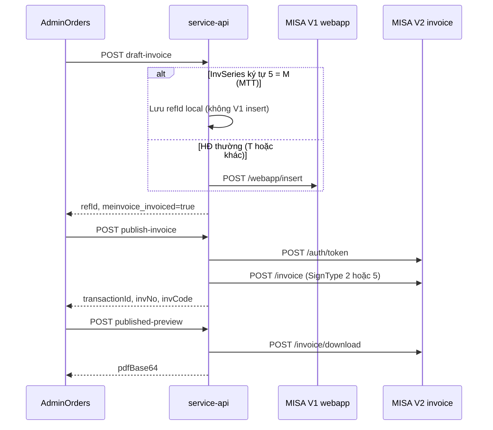

# Tích hợp MISA MeInvoice — Thiyen (service-api)

Tài liệu **triển khai thực tế** trong repo. Spec gốc MISA:

| Tài liệu | Phạm vi |
|----------|---------|
| [Tài liệu API Tạp hóa đơn Misa.md](./Tài%20liệu%20API%20Tạp%20hóa%20đơn%20Misa.md) | **V1** — `/webapp/*` (token, mẫu, insert, preview, viewrefid, delete) |
| [Tài liệu API Tạo hóa đơn Misa_V2.md](./Tài%20liệu%20API%20Tạo%20hóa%20đơn%20Misa_V2.md) | **V2** — `/auth/token`, `/invoice` (phát hành HSM / MTT, status, download) |
| [API AIO WEB APP_MISA.postman_collection.json](./API%20AIO%20WEB%20APP_MISA.postman_collection.json) | Postman sandbox chính thức |

---

## Luồng nghiệp vụ (Admin Thiyen)

### Trạng thái đơn (`orders`)

| Cờ / cột | Ý nghĩa |
|----------|---------|
| `meinvoice_invoiced` | Đã **chuẩn bị** xuất HĐ (có `meinvoice_ref_id`) |
| `meinvoice_ref_id` | RefID dùng xuyên suốt V1 preview và V2 publish |
| `meinvoice_draft_deleted` | Đã xóa nháp trên MISA (V1 delete); vẫn giữ refId để xem PDF cũ |
| `meinvoice_published` | Đã **phát hành** thành công (có `transaction_id` hoặc `inv_no`) |
| `meinvoice_transaction_id` | Tra status / download PDF đã phát hành |
| `meinvoice_inv_no` | Số hóa đơn sau phát hành |

**Quan trọng:** PDF **preview** (`/webapp/preview`) có thể hiển thị số HĐ / mã tra cứu **mà chưa** có trên danh sách MISA — chỉ coi là đã phát hành khi `meinvoice_published=true` và thấy trên **app3** / **testapp3**.

### Ký hiệu `InvSeries` (ký tự thứ 5, index 4)

| Ký tự | Loại | Tạo nháp (Thiyen) | Phát hành V2 |
|-------|------|-------------------|--------------|
| **M** | Máy tính tiền (MTT) | **Không** gọi V1 insert — chỉ lưu refId (`draftSource: mtt-v2-publish`) | `invoiceCalcu=true`, **SignType 5** |
| **T** | Hóa đơn thường | V1 `/webapp/insert` | `invoiceCalcu=false`, **SignType 2** (HSM) |

Ví dụ cấu hình hiện tại: **HĐ bán hàng** `2C26MYY` (prod) / sandbox tương ứng trong `application-dev.yml`.

### Gửi email

- `meinvoice.publish.send-email: false` (mặc định) → payload V2 `IsSendEmail: false` (không gửi email khách, giống UI MISA bỏ chọn checkbox).

---

## API Admin (JWT admin)

Base: `/api/thiyen/admin/integration/meinvoice` (alias `/api/dragun/admin/...`).

| Method | Path | MISA / ghi chú |
|--------|------|----------------|
| POST | `/test-connection` | V1 token + `/webapp/templates` |
| GET | `/templates` | `/webapp/templates` |
| POST | `/orders/{orderId}/draft-invoice?by=order\|pancake` | V1 insert **hoặc** MTT local ref |
| DELETE | `/invoices?refId=` | `/webapp/delete` |
| POST | `/orders/{orderId}/invoice-preview?refId=` | `/webapp/preview` → `pdfBase64` |
| GET | `/invoices/pdf?refId=` | `/webapp/viewrefid` |
| POST | `/orders/{orderId}/publish-invoice` | V2 `POST /invoice` |
| POST | `/orders/{orderId}/invoice-status` | V2 `POST /invoice/status` |
| POST | `/invoices/published-preview?transactionId=&refId=` | V2 download (+ fallback viewrefid) |
| GET | `/invoices/published-pdf?transactionId=` | V2 download (file) |
| POST | `/lookup-by-ref-ids` | `/webapp/getlist` |

**Pancake test:** `/api/thiyen/admin/integration/pancake-meinvoice` — mapping preview, preview MISA không insert, draft, submissions (cùng `MeinvoiceInvoiceService`).

---

## Cấu hình (`application-dev.yml` / `application-prod.yml`)

| Key | Sandbox (dev) | Production (prod) |
|-----|---------------|-------------------|
| `meinvoice.api.base-url` | `https://testapi.meinvoice.vn/api/integration` | `https://api.meinvoice.vn/api/integration` |
| UI tra cứu / danh sách | https://testapp3.meinvoice.vn | https://app3.meinvoice.vn |
| Tra cứu công khai | **Không** dùng https://www.meinvoice.vn/tra-cuu/ cho sandbox | Prod mới dùng cổng tra cứu công khai |
| `credentials` | MST/user sandbox Postman | `MEINVOICE_*` env (Thiyen golive) |
| `defaults.invoice-template-id` + `inv-series` | Lấy từ `GET .../templates` | Mẫu prod trên app3 |
| `publish.sign-type` / `sign-type-mtt` | `2` / `5` | `2` / `5` |
| `publish.send-email` | `false` | `false` |

Biến môi trường thường dùng: `MEINVOICE_ENABLED`, `MEINVOICE_API_BASE_URL`, `MEINVOICE_TAXCODE`, `MEINVOICE_USERNAME`, `MEINVOICE_PASSWORD`, `MEINVOICE_APP_ID`, `MEINVOICE_TEMPLATE_ID`, `MEINVOICE_INV_SERIES`, `MEINVOICE_PUBLISH_SEND_EMAIL`.

**InvDate khi publish:** luôn **ngày hiện tại (VN)**, không dùng `orders.created_at` — tránh `InvalidInvoiceDate` cùng `InvSeries`.

---

## Mã nguồn chính

| Vai trò | Class |
|---------|--------|
| Cấu hình | `MeinvoiceIntegrationConfig` |
| V1 HTTP | `MeinvoiceApiClient`, `MeinvoiceAuthService` |
| V1 nghiệp vụ | `MeinvoiceInvoiceService` |
| V2 publish | `MeinvoicePublishService`, `MeinvoicePublishApiClient`, `MeinvoicePublishAuthService` |
| Payload V2 | `MeinvoiceV2InvoiceDataBuilder` |
| MTT / SignType | `MeinvoiceInvSeriesHelper`, `MeinvoicePublishOptions` |
| VAT / làm tròn / `VATRateName` | `MeinvoiceVatMath` |
| Parse PDF / publish result | `MeinvoicePreviewPdfParser`, `MeinvoicePublishedPdfParser`, `MeinvoicePublishResultParser` |
| Admin REST | `AdminMeinvoiceController`, `AdminPancakeMeinvoiceController` |
| Idempotency | `MeinvoiceSubmission`, Flyway `V16`, `V19`, `V22` |

---

## Kiểm tra nhanh sau deploy

1. `POST .../meinvoice/test-connection` → `tokenOk`, `templateCount` ≥ 1, `invSeries` khớp kế toán.
2. Đơn test: **Tạo HĐ** → **Phát hành** → response có `transactionId` + `invNo`.
3. MISA UI: đúng MST, **năm** khớp ký hiệu (vd. `26` → 2026), menu **HĐ từ máy tính tiền** nếu series có `M`.
4. Không kỳ vọng mã tra cứu từ PDF preview xuất hiện trên tra cứu prod khi đang chạy sandbox.

---

## Việc chưa làm / cần BA

- Validate tổng tiền đơn vs tổng MeInvoice (làm tròn).
- Thuế suất theo từng SKU (hiện một `default-vat-rate`).
- Bọc `/webapp/paging` nếu cần đối soát hàng loạt.
- Không commit mật khẩu MeInvoice; prod dùng secret manager.
