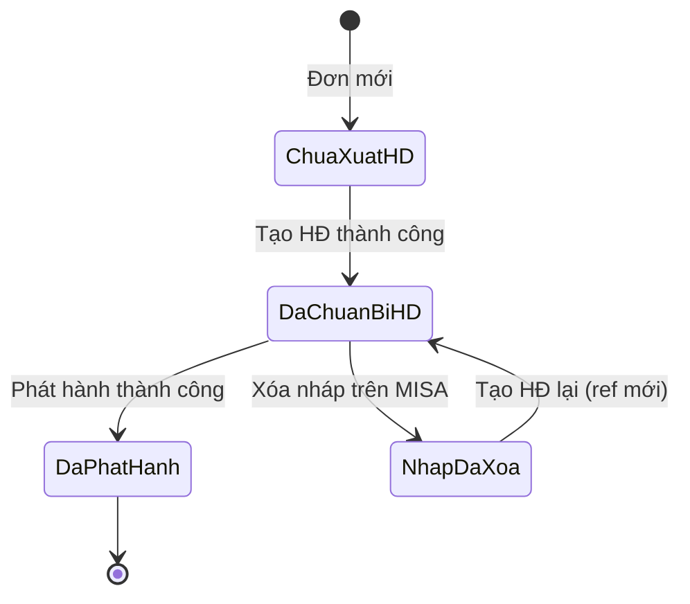

# Đặc tả nghiệp vụ — Tích hợp hóa đơn điện tử MISA MeInvoice (Thiyen)

| Thuộc tính | Giá trị |
|------------|---------|
| Phiên bản | 1.0 |
| Ngày | 2026-05-19 |
| Hệ thống | Thiyen E-commerce — `service-api` + `service-ui` (Admin) |
| Tích hợp | MISA MeInvoice API (V1 WebApp + V2 Phát hành) |
| Tài liệu tham chiếu MISA | [V1 — Tạo HĐ chưa phát hành](./Tài%20liệu%20API%20Tạp%20hóa%20đơn%20Misa.md), [V2 — Phát hành HĐ](./Tài%20liệu%20API%20Tạo%20hóa%20đơn%20Misa_V2.md) |
| Triển khai kỹ thuật | [07-meinvoice-detail-design.md](./07-meinvoice-detail-design.md) |
| Tóm tắt kỹ thuật | [05-meinvoice-integration-conclusion.md](./05-meinvoice-integration-conclusion.md) |

---

## 1. Mục tiêu và phạm vi

### 1.1 Mục tiêu

Cho phép **quản trị viên Thiyen** xuất hóa đơn điện tử MISA từ **đơn hàng** (đồng bộ từ Pancake POS hoặc tạo trên hệ thống), theo quy trình:

1. **Chuẩn bị hóa đơn** (gán RefID, tạo nháp trên MISA hoặc chuẩn bị local với MTT).
2. **Xem trước PDF** (nháp / đã phát hành).
3. **Phát hành** lên MISA (cấp số, mã CQT / mã tra cứu).
4. **Tra cứu / tải PDF** sau phát hành.

Giảm thao tác thủ công trên app MISA, đảm bảo dữ liệu đơn ↔ hóa đơn thống nhất và tránh xuất trùng.

### 1.2 Phạm vi trong (In scope)

- Tích hợp API MISA qua backend `service-api` (proxy + nghiệp vụ).
- Màn hình **Admin — Quản lý đơn hàng** (`AdminOrders.vue`): Tạo HĐ, Xem PDF, Phát hành, Xóa nháp (nếu có).
- Một mẫu hóa đơn mặc định theo cấu hình (`inv-series`, `invoice-template-id`).
- Hóa đơn **có mã CQT** (`invoice-with-code: true`).
- Hỗ trợ **hóa đơn bán hàng từ máy tính tiền (MTT)** — ký hiệu `InvSeries` có ký tự thứ 5 = `M` (vd. `2C26MYY`).
- Không gửi email hóa đơn cho khách hàng khi phát hành (mặc định).

### 1.3 Ngoài phạm vi (Out of scope) — giai đoạn hiện tại

- Portal tra cứu công khai cho người mua (chỉ admin + MISA UI).
- Điều chỉnh / thay thế / hủy hóa đơn (API V2 xử lý sai sót).
- Gửi email hóa đơn tự động (`send-email` có thể bật sau).
- Tự động phát hành khi đơn chuyển trạng thái (chỉ thủ công trên admin).
- Nhiều mẫu HĐ / nhiều `InvSeries` chọn trên UI (một cấu hình global).
- Thuế suất theo từng sản phẩm (một mức VAT mặc định).
- Đối soát hàng loạt qua `/webapp/paging` (chưa có API admin).

---

## 2. Đối tượng và vai trò

| Vai trò | Mô tả |
|---------|--------|
| **Admin Thiyen** | Đăng nhập JWT admin; thao tác Tạo HĐ / Phát hành / Xem PDF trên danh sách đơn. |
| **Kế toán / MISA** | Cấp MST, tài khoản MeInvoice, mẫu HĐ, tờ khai CQT; đối chiếu trên app3 / testapp3. |
| **Hệ thống Thiyen** | Map đơn → payload MISA; lưu trạng thái; gọi API V1/V2. |
| **MISA MeInvoice** | Lưu nháp, phát hành, cấp mã, lưu PDF. |

---

## 3. Khái niệm nghiệp vụ

| Thuật ngữ | Định nghĩa |
|-----------|------------|
| **RefID** | UUID do Thiyen sinh; khóa xuyên suốt preview V1 và publish V2 cho một lần xuất HĐ trên đơn. |
| **Nháp (draft)** | Đơn đã **Tạo HĐ**: `meinvoice_invoiced = true`, có `meinvoice_ref_id`. Với HĐ thường: có bản ghi trên MISA V1. Với MTT: chỉ lưu local, chưa insert V1. |
| **Phát hành (publish)** | Gọi V2 `POST /invoice`; MISA cấp **số HĐ**, **TransactionID**, **mã tra cứu (InvCode)**. `meinvoice_published = true`. |
| **Preview PDF** | PDF từ `/webapp/preview` — **có thể** hiển thị số/mã **trước** khi phát hành thật; không dùng làm bằng chứng phát hành. |
| **InvSeries (ký hiệu)** | Chuỗi mẫu HĐ (vd. `2C26MYY`). Ký tự vị trí 5: **M** = MTT, **T** = hóa đơn thường. |
| **MTT** | Hóa đơn khởi tạo từ máy tính tiền; phát hành SignType **5**, không ký số trên HĐ (theo UI MISA). |
| **Sandbox / Production** | Sandbox: testapi + testapp3. Production: api + app3. **Không** tra cứu sandbox trên meinvoice.vn/tra-cuu. |

---

## 4. Tiền điều kiện (MISA & Thiyen)

### 4.1 Phía MISA / kế toán

- Đã đăng ký **API MeInvoice** và có `app-id`.
- Tài khoản MeInvoice (MST, user, password) hoạt động trên môi trường tương ứng.
- Tờ khai / mẫu HĐ ở trạng thái **Đang sử dụng**, CQT chấp nhận (nếu có mã).
- Đã chọn đúng **mẫu + ký hiệu** (`IPTemplateID`, `InvSeries`) — lấy từ `GET /webapp/templates` hoặc app3.

### 4.2 Phía Thiyen

- Đơn có **ít nhất một dòng hàng**, tên hàng hợp lệ (không phải sản phẩm catalog chưa map Pancake).
- Có **tên, SĐT, địa chỉ** khách (bắt buộc trước khi tạo HĐ).
- `meinvoice.enabled=true` và đủ cấu hình template/series.
- Admin đăng nhập với quyền gọi API `/api/thiyen/admin/**`.

---

## 5. Luồng nghiệp vụ chính

### 5.1 Sơ đồ trạng thái đơn (MeInvoice)

| Trạng thái UI (gợi ý) | Điều kiện DB |
|----------------------|--------------|
| (không nhãn) | `meinvoice_invoiced = false` |
| Đã tạo HĐ / sẵn sàng phát hành | `meinvoice_invoiced = true`, `meinvoice_published = false`, `meinvoice_draft_deleted = false` |
| Đã phát hành | `meinvoice_published = true` (+ `meinvoice_inv_no` / `transaction_id`) |
| Nháp đã xóa | `meinvoice_draft_deleted = true` (vẫn có thể giữ refId) |

### 5.2 Luồng 1 — Tạo hóa đơn (chuẩn bị)

**Tác nhân:** Admin  
**Điều kiện:** Đơn chưa invoiced; validation pass.

| Bước | Hành động | Hệ thống | MISA |
|------|-----------|----------|------|
| 1 | Chọn **Tạo HĐ** trên đơn | Kiểm tra dòng hàng, khách, catalog | — |
| 2 | Xác nhận (nếu có popup) | Sinh `refId` (UUID) | — |
| 3a | **MTT** (`InvSeries` …**M**…) | Lưu ref + submission success; **không** gọi insert | — |
| 3b | **HĐ thường** | Build payload V1 | `POST /webapp/insert` |
| 4 | — | `meinvoice_invoiced=true`, lưu `meinvoice_ref_id` | — |

**Kết quả:** Admin thấy trạng thái đã tạo HĐ; có thể **Xem trước PDF** (preview).

### 5.3 Luồng 2 — Xem trước PDF (nháp)

| Bước | Hành động | MISA |
|------|-----------|------|
| 1 | **Xem PDF** / popup | `POST /webapp/preview` với payload đơn + `refId` |
| 2 | UI decode base64 → PDF.js | — |

**Quy tắc BA:** Nội dung PDF preview **không** chứng minh HĐ đã có trên danh sách MISA hoặc đã phát hành.

### 5.4 Luồng 3 — Phát hành hóa đơn

**Tác nhân:** Admin  
**Điều kiện:** Đã tạo HĐ; chưa published; chưa xóa nháp; `publish.enabled=true`.

| Bước | Hành động | Hệ thống | MISA V2 |
|------|-----------|----------|---------|
| 1 | **Phát hành** | Validate; build `InvoiceData` V2 (ngày HĐ = **hôm nay VN**) | — |
| 2 | — | `POST /auth/token` (appid) | Token JWT |
| 3 | — | `POST /invoice` SignType 2 hoặc **5** (MTT) | Phát hành |
| 4 | — | Parse `TransactionID`, `InvNo`, `InvCode` | — |
| 5 | — | `meinvoice_published=true`, lưu số + transaction | — |

**Mặc định:** `IsSendEmail = false` (không gửi email khách).

**Sau phát hành:** Đối chiếu trên **testapp3 / app3** (đúng MST, **năm** theo ký hiệu, menu MTT nếu có `M`).

### 5.5 Luồng 4 — Xem / tải PDF đã phát hành

| Cách | API Thiyen | MISA |
|------|------------|------|
| Popup admin | `POST .../published-preview?transactionId=&refId=` | `POST /invoice/download` (fallback `viewrefid`) |
| Tải file | `GET .../published-pdf?transactionId=` | `POST /invoice/download` |

### 5.6 Luồng 5 — Xóa hóa đơn nháp (tùy chọn)

Chỉ áp dụng khi đã tạo nháp V1 trên MISA (**không** xóa được bản ghi MTT-only local).

| Bước | MISA |
|------|------|
| 1 | `DELETE /webapp/delete?refId=` |
| 2 | Thiyen: `meinvoice_draft_deleted=true`, submission `success=false` |

### 5.7 Luồng phụ — Kiểm tra kết nối / mẫu HĐ

- **Test connection:** V1 token + đếm mẫu từ `/webapp/templates`.
- **Templates:** Trả danh sách mẫu để kế toán đối chiếu `IPTemplateID` / `InvSeries` với config.

---

## 6. Quy tắc nghiệp vụ (Business Rules)

| ID | Quy tắc |
|----|---------|
| BR-01 | Một đơn chỉ **một lần** tạo HĐ thành công (unique submission success / cờ `meinvoice_invoiced`). |
| BR-02 | **RefID** giữ nguyên từ Tạo HĐ đến Phát hành (cùng đơn). |
| BR-03 | **InvDate** lúc phát hành = ngày hiện tại (VN), không lấy ngày tạo đơn — tránh `InvalidInvoiceDate`. |
| BR-04 | MTT: không gọi V1 insert; phát hành bắt buộc qua V2 SignType **5**, `invoiceCalcu=true`. |
| BR-05 | HĐ thường: V1 insert nháp; phát hành SignType **2** (HSM), `invoiceCalcu=false`. |
| BR-06 | Chỉ coi **Đã phát hành** khi API trả `TransactionID` hoặc `InvNo` và `meinvoice_published=true`. |
| BR-07 | Mặc định **không gửi email** khách khi phát hành. |
| BR-08 | Giá dòng hàng: mặc định **chưa VAT** (`assume-prices-exclude-vat=true`); VAT tính theo `default-vat-rate`. |
| BR-09 | Phí ship (nếu > 0): một dòng **Phí vận chuyển** + cùng thuế suất mặc định. |
| BR-10 | Dòng có sản phẩm Pancake **chưa map catalog** → chặn tạo HĐ. |
| BR-11 | Tra cứu sandbox: dùng **testapp3**, không dùng cổng tra cứu công khai production. |

---

## 7. Ánh xạ dữ liệu đơn → Hóa đơn MISA

| Nguồn Thiyen (`orders` / `order_items`) | Trường MISA (tóm tắt) |
|----------------------------------------|------------------------|
| `customer_name` | `AccountObjectName` / `BuyerFullName` |
| `customer_address` | `AccountObjectAddress` / `BuyerAddress` |
| `customer_phone` | `ReceiverMobile` / `BuyerPhoneNumber` |
| `order_id` | `BuyerOrderCode` (V2) |
| `order_items[].product_name`, quantity, price | `InvoiceDetails` / `OriginalInvoiceDetail` |
| `shipping_fee` | Dòng **Phí vận chuyển** |
| `payment_method` | `PaymentMethod` / `PaymentMethodName` (TM/CK, Tiền mặt, CK) |
| Config `inv-series`, `invoice-template-id` | `InvSeries`, `InvoiceTemplateID` (V1) |

---

## 8. Giao diện Admin (service-ui)

**Màn hình:** `AdminOrders.vue`  
**API base:** `/api/thiyen/admin/integration/meinvoice`

| Nút / hành động | Điều kiện hiển thị | API |
|-----------------|-------------------|-----|
| Tạo HĐ | Đơn chưa invoiced hoặc chưa published theo rule UI | `POST .../draft-invoice` |
| Phát hành | Đã tạo HĐ, chưa published, chưa xóa nháp | `POST .../publish-invoice` |
| Xem PDF | Có refId hoặc đã published (transactionId) | preview / published-preview |
| Tải PDF | Có refId hoặc transactionId | GET pdf / published-pdf |
| Xóa nháp | Đã tạo HĐ, chưa published, chưa xóa | `DELETE .../invoices?refId=` |

**Thông báo phát hành thành công:** hiển thị Số HĐ, TransactionID, Mã tra cứu (nếu có trong response).

---

## 9. Cấu hình theo môi trường

| Tham số | Mô tả nghiệp vụ |
|---------|-----------------|
| `meinvoice.enabled` | Bật/tắt toàn bộ tích hợp |
| `meinvoice.api.base-url` | Sandbox vs Production |
| `meinvoice.credentials.*` | MST, user, password, app-id |
| `meinvoice.defaults.invoice-template-id` | Mẫu HĐ (phải khớp series) |
| `meinvoice.defaults.inv-series` | Ký hiệu (quyết định MTT vs thường) |
| `meinvoice.defaults.invoice-with-code` | HĐ có mã CQT |
| `meinvoice.defaults.default-vat-rate` | Thuế suất % mặc định |
| `meinvoice.defaults.assume-prices-exclude-vat` | Giá đơn chưa/đã gồm VAT |
| `meinvoice.publish.enabled` | Cho phép phát hành API |
| `meinvoice.publish.send-email` | Gửi email khi phát hành (mặc định false) |
| `meinvoice.publish.sign-type` / `sign-type-mtt` | 2 (HSM) / 5 (MTT) |

**Ví dụ hiện tại:**

- **Dev:** `2C26MYY` + template `a1d73e77-...` (sandbox).
- **Prod:** `2C26MYY` + template `4ae1095d-...` (Thiyen golive).

---

## 10. Tiêu chí chấp nhận (UAT)

| ID | Kịch bản | Kết quả mong đợi |
|----|----------|------------------|
| AC-01 | Test connection sau cấu hình đúng | `tokenOk=true`, `templateCount >= 1` |
| AC-02 | Tạo HĐ đơn Pancake hợp lệ (MTT) | `recordedSuccess=true`, có `refId`, không lỗi MISA insert |
| AC-03 | Preview PDF nháp | Popup hiển thị PDF |
| AC-04 | Phát hành | `meinvoice_published=true`, có `invNo` hoặc `transactionId` |
| AC-05 | PDF đã phát hành | Popup/tải được PDF từ download API |
| AC-06 | Đối chiếu MISA UI | Dòng HĐ đúng số, mã, năm, menu MTT |
| AC-07 | Tạo HĐ lần 2 cùng đơn | Bị chặn (đã invoiced) |
| AC-08 | Đơn thiếu tên/SĐT/địa chỉ | Báo lỗi validation, không gọi MISA |
| AC-09 | Sandbox: tra cứu mã trên meinvoice.vn | Không bắt buộc tìm thấy; dùng testapp3 |

---

## 11. Rủi ro và giả định

| Rủi ro | Giảm thiểu |
|--------|------------|
| Nhầm sandbox vs prod tra cứu | Đào tạo; doc BR-11 |
| Coi preview = đã phát hành | UI label; BR-06 |
| Lệch tổng tiền đơn vs MISA | BA chốt làm tròn (chưa validate cứng) |
| Mật khẩu MISA trong repo | Env/secret manager trên prod |

**Giả định:** Một cửa hàng / một MST trên môi trường config; đơn nguồn chủ yếu từ Pancake sync.

---

## 12. Phụ lục — API MISA tham chiếu

### V1 (WebApp) — [Tài liệu V1](./Tài%20liệu%20API%20Tạp%20hóa%20đơn%20Misa.md)

| API | Mục đích Thiyen |
|-----|----------------|
| `POST /webapp/token` | Token V1 |
| `POST /webapp/templates` | Danh sách mẫu |
| `POST /webapp/insert` | Tạo nháp (HĐ thường) |
| `POST /webapp/preview` | PDF preview |
| `GET /webapp/viewrefid` | Tải PDF theo ref |
| `DELETE /webapp/delete` | Xóa nháp |
| `POST /webapp/getlist` | Tra theo danh sách RefID |

### V2 — [Tài liệu V2](./Tài%20liệu%20API%20Tạo%20hóa%20đơn%20Misa_V2.md)

| API | Mục đích Thiyen |
|-----|----------------|
| `POST /auth/token` | Token publish (appid) |
| `POST /invoice` | Phát hành |
| `POST /invoice/status` | Đồng bộ trạng thái CQT |
| `POST /invoice/download` | PDF đã phát hành |

---

*Tài liệu này mô tả **WHAT** và **WHY**. Chi tiết **HOW** (class, DB, contract JSON) xem [07-meinvoice-detail-design.md](./07-meinvoice-detail-design.md).*
