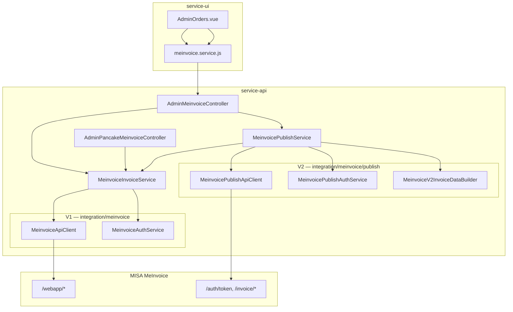
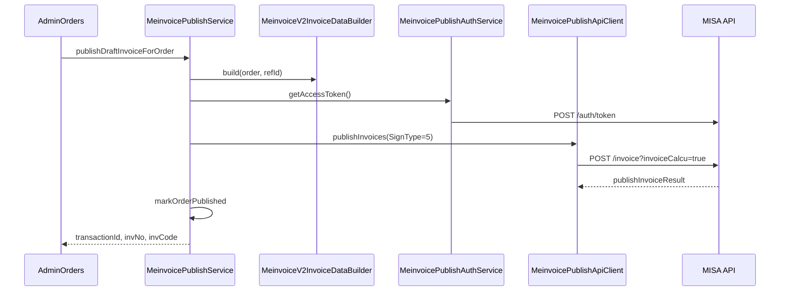

# Detail Design — Tích hợp MISA MeInvoice (Thiyen service-api)

| Thuộc tính | Giá trị |
|------------|---------|
| Phiên bản | 1.0 |
| Ngày | 2026-05-19 |
| Đặc tả nghiệp vụ | [06-meinvoice-functional-specification.md](./06-meinvoice-functional-specification.md) |
| Spec MISA | [V1](./Tài%20liệu%20API%20Tạp%20hóa%20đơn%20Misa.md), [V2](./Tài%20liệu%20API%20Tạo%20hóa%20đơn%20Misa_V2.md) |
| Cheatsheet vận hành | [05-meinvoice-integration-conclusion.md](./05-meinvoice-integration-conclusion.md) |

---

## 1. Kiến trúc tổng quan



### 1.1 Phân tách V1 / V2

| Layer | Mục đích | Không dùng cho |
|-------|---------|----------------|
| **V1** `MeinvoiceApiClient` | Token webapp, insert, preview, viewrefid, delete, templates | Phát hành chính thức |
| **V2** `MeinvoicePublishApiClient` | auth/token (appid), publish, status, download | Insert nháp MTT |

Payload **V1** (`MeinvoiceInvoiceData` + `InvoiceDetails`) và **V2** (`MeinvoiceV2InvoiceData` + `OriginalInvoiceDetail`) là **hai schema khác nhau** — không serialize chung một object cho publish.

---

## 2. Package structure

```
com.dragun.ecommerce.integration.meinvoice/
├── config/
│   ├── MeinvoiceIntegrationConfig.java    # @ConfigurationProperties("meinvoice")
│   └── MeinvoiceWebClientConfig.java      # WebClient bean "meinvoiceWebClient"
├── client/
│   ├── MeinvoiceApiClient.java            # V1 HTTP
│   ├── MeinvoiceApiErrorParser.java
│   ├── MeinvoicePreviewPdfParser.java
│   └── MeinvoiceViewRefIdParser.java
├── service/
│   ├── MeinvoiceAuthService.java          # Cache V1 token
│   └── MeinvoiceInvoiceService.java       # Draft, preview, delete, validation
├── publish/
│   ├── MeinvoicePublishConstants.java
│   ├── service/
│   │   ├── MeinvoicePublishService.java
│   │   └── MeinvoicePublishAuthService.java
│   ├── client/
│   │   ├── MeinvoicePublishApiClient.java
│   │   ├── MeinvoicePublishResultParser.java
│   │   └── MeinvoicePublishedPdfParser.java
│   ├── mapper/
│   │   └── MeinvoiceV2InvoiceDataBuilder.java
│   └── dto/
│       ├── MeinvoiceV2InvoiceData.java
│       ├── MeinvoicePublishInvoiceRequest.java
│       └── MeinvoicePublishLoginRequest.java
├── dto/                                   # V1 DTOs
├── model/MeinvoiceSubmission.java
├── repository/MeinvoiceSubmissionRepository.java
├── MeinvoiceIntegrationConstants.java
├── MeinvoiceInvSeriesHelper.java          # Char index 4: M = MTT
├── MeinvoicePublishOptions.java           # signType, invoiceCalcu
└── MeinvoiceVatMath.java                  # VAT + VATRateName

controller/admin/
├── AdminMeinvoiceController.java          # Production admin API
└── AdminPancakeMeinvoiceController.java   # Mapping / test helpers
```

---

## 3. Luồng xử lý chi tiết

### 3.1 Tạo hóa đơn — `MeinvoiceInvoiceService.createDraftInvoiceForOrder`

```
1. requireEnabledAndCredentials()
2. requireTemplateConfigured()  // template-id + inv-series non-empty
3. resolveOrder(orderKey, lookupByPancake)
4. collectInvoiceValidationIssues(order, blockIfAlreadyInvoiced=true)
5. assertOrderNotYetInvoiced(order)
6. refId = UUID.randomUUID()

IF MeinvoiceInvSeriesHelper.isCalculatingMachineSeries(invSeries):
    createMttLocalDraftRef()
      - markOrderInvoiced(order, refId)
      - submission success=true, message "MTT local ref..."
      - result.draftSource = "mtt-v2-publish"
      - NO call /webapp/insert
ELSE:
    buildInvoiceData(order, refId)  // V1 payload
    meinvoiceApiClient.insertInvoices([data])
    submission + markOrderInvoiced on success
```

### 3.2 Phát hành — `MeinvoicePublishService.publishDraftInvoiceForOrder`

```
1. requirePublishEnabled()
2. meinvoiceInvoiceService.requireIntegrationReady()
3. resolveOrder + collectPublishValidationIssues()
      + draft_deleted / already_published / no refId checks
4. MeinvoiceV2InvoiceDataBuilder.build(order, refId, config)
5. synchronized(lock per invSeries)  // tránh trùng số
6. publishWithRetry() -> POST /invoice
      signType = MeinvoicePublishOptions.signType(config)
      invoiceCalcu = MeinvoicePublishOptions.invoiceCalculatingMachine(config)
7. markOrderPublished() — requires transactionId OR invNo
8. syncInvoiceStatusQuietly() — optional POST /invoice/status
```

**InvDate:** `LocalDate.now(Asia/Ho_Chi_Minh)` — format `yyyy-MM-dd` (V2).

**IsSendEmail:** `config.publish.sendEmail` → boolean on `MeinvoiceV2InvoiceData`.

### 3.3 PDF đã phát hành — fallback

`previewPublishedPdfBase64(transactionId, refId)`:

1. Try `POST /invoice/download` → `MeinvoicePublishedPdfParser`
2. On failure + có `refId`: `GET /webapp/viewrefid` (V1)

---

## 4. Cơ sở dữ liệu

### 4.1 Bảng `orders` (cột MeInvoice)

| Cột | Type | Mô tả |
|-----|------|--------|
| `meinvoice_invoiced` | BOOLEAN | Đã chuẩn bị (có ref) |
| `meinvoice_ref_id` | VARCHAR(64) | RefID |
| `meinvoice_invoiced_at` | TIMESTAMP | Thời điểm tạo HĐ |
| `meinvoice_draft_deleted` | BOOLEAN | Đã xóa nháp MISA |
| `meinvoice_published` | BOOLEAN | Đã phát hành |
| `meinvoice_published_at` | TIMESTAMP | |
| `meinvoice_transaction_id` | VARCHAR(64) | V2 TransactionID |
| `meinvoice_inv_no` | VARCHAR(32) | Số HĐ |
| `meinvoice_publish_error_code` | VARCHAR(128) | Lỗi publish (nếu có) |
| `meinvoice_send_tax_status` | INTEGER | SendTaxStatus từ status API |

**Flyway:** `V19`, `V21`, `V22`.

### 4.2 Bảng `meinvoice_submissions`

Idempotency + audit:

| Cột | Mô tả |
|-----|--------|
| `ref_id` | UNIQUE |
| `order_business_id` | `orders.order_id` |
| `success` | Lần gọi insert/local draft thành công |
| `last_error_code`, `last_message` | Lỗi MISA |

**Unique partial index:** một dòng `success=true` / `order_business_id`.

### 4.3 Ánh xạ API → OrderResponse

`OrderService` map `misaInvoiceRef` ← `meinvoice_ref_id` (alias UI).

---

## 5. REST API contract (Admin)

**Base paths:**

- `/api/thiyen/admin/integration/meinvoice`
- `/api/dragun/admin/integration/meinvoice` (alias)

**Auth:** JWT admin (cùng `SecurityConfig` với admin khác).

### 5.1 Endpoints

| Method | Path | Request | Response `data` (chính) |
|--------|------|---------|-------------------------|
| POST | `/test-connection` | — | `tokenOk`, `templateCount`, `invSeries`, `publishSignType`, … |
| GET | `/templates` | `?invoiceWithCode=` | JsonNode MISA |
| POST | `/orders/{orderId}/draft-invoice` | `?by=order\|pancake` | `refId`, `recordedSuccess`, `draftSource?`, `meinvoiceRefId` |
| DELETE | `/invoices` | `?refId=&orderId=` | Map delete result |
| POST | `/orders/{orderId}/invoice-preview` | `?refId=&by=` | `{ pdfBase64 }` |
| GET | `/invoices/pdf` | `?refId=` | `application/pdf` bytes |
| POST | `/orders/{orderId}/publish-invoice` | `?by=` | `transactionId`, `invNo`, `invCode?`, `published` |
| POST | `/orders/{orderId}/invoice-status` | `?by=` | status + order flags |
| POST | `/invoices/published-preview` | `?transactionId=&refId=` | `{ pdfBase64, pdfSource }` |
| GET | `/invoices/published-pdf` | `?transactionId=` | PDF bytes |
| POST | `/lookup-by-ref-ids` | body: `List<String>` refIds | JsonNode |

**Envelope:** `ApiResponse<T>` — `success`, `message`, `data`.

### 5.2 Pancake test API

**Base:** `/api/thiyen/admin/integration/pancake-meinvoice`

| Method | Path | Ghi chú |
|--------|------|---------|
| GET | `/orders` | Danh sách đơn Pancake + validation summary |
| GET | `/orders/{key}/mapping` | Payload preview không gọi MISA |
| POST | `/orders/{key}/preview` | Gọi MISA preview không insert |
| POST | `/orders/{key}/draft-invoice` | Cùng service với admin |
| GET | `/orders/{key}/submissions` | Lịch sử submission |

---

## 6. Tích hợp MISA — kỹ thuật

### 6.1 HTTP headers (chung)

| Header | V1 | V2 |
|--------|----|----|
| `Authorization` | `Bearer {v1_token}` | `Bearer {v2_jwt}` |
| `taxcode` | MST credentials | MST |
| `CompanyTaxCode` | — | MST (publish client) |

### 6.2 Token

| Loại | Endpoint | Cache |
|------|----------|-------|
| V1 | `POST {base}/webapp/token` body lowercase `taxcode`, `username`, `password` | `MeinvoiceAuthService` |
| V2 | `POST {base}/auth/token` body `appid`, `taxcode`, `username`, `password` | `MeinvoicePublishAuthService` |

Response `data` thường là **chuỗi JSON** — parse `access_token` / JWT.

### 6.3 Publish request body

```json
{
  "SignType": 5,
  "CertificateSN": null,
  "InvoiceData": [ { /* MeinvoiceV2InvoiceData */ } ],
  "PublishInvoiceData": null
}
```

| SignType | Khi nào |
|----------|---------|
| 2 | `InvSeries` char[4] ≠ M (HSM) |
| 5 | MTT (`MeinvoiceInvSeriesHelper`) |

Query khi status/download:

- `invoiceWithCode=true|false`
- `invoiceCalcu=true|false` (auto từ MTT)
- `inputType=1` (transactionId) hoặc `2` (refId)

### 6.4 Response publish — parse

`MeinvoicePublishResultParser.parseFirstItem(root)`:

- Đọc `publishInvoiceResult` (string JSON hoặc array)
- Item lỗi: `ErrorCode` → throw
- Thành công: bắt buộc `TransactionID` hoặc `InvNo`; optional `InvCode`

Nếu chỉ có `createInvoiceResult` → lỗi cấu hình SignType (đang dùng SignType 1 / sai luồng).

---

## 7. Cấu hình (`MeinvoiceIntegrationConfig`)

```yaml
meinvoice:
  enabled: true
  api:
    base-url: https://testapi.meinvoice.vn/api/integration
    timeout-ms: 60000
  credentials:
    taxcode: ...
    username: ...
    password: ...
    app-id: ...
  publish:
    enabled: true
    sign-type: 2
    sign-type-mtt: 5
    certificate-sn: ""      # optional; HSM SignType 2 auto fetch certs
    sequential-delay-ms: 3000
    send-email: false
  defaults:
    invoice-with-code: true
    invoice-template-id: <UUID>
    inv-series: 2C26MYY
    # invoice-calculating-machine: null  # auto từ inv-series
    currency-code: VND
    default-vat-rate: 10
    default-unit-name: Cái
    assume-prices-exclude-vat: true
```

**Profile files:** `application-dev.yml`, `application-prod.yml`.

---

## 8. Validation codes

| Code | Khi nào |
|------|---------|
| `MEINVOICE_DISABLED` | `enabled=false` |
| `MEINVOICE_TEMPLATE_NOT_CONFIGURED` | Thiếu template/series |
| `NO_LINE_ITEMS` | Đơn không có dòng |
| `MISSING_CUSTOMER_NAME/PHONE/ADDRESS` | Thiếu thông tin khách |
| `UNMAPPED_CATALOG_LINE:...` | Sản phẩm Pancake placeholder |
| `MEINVOICE_ALREADY_INVOICED` | Tạo HĐ lần 2 |
| `MEINVOICE_ALREADY_PUBLISHED` | Publish lần 2 |
| `MEINVOICE_DRAFT_DELETED` | Đã xóa nháp |
| `MEINVOICE_NO_DRAFT_REF` | Publish không có refId |

---

## 9. Xử lý lỗi & retry

| Tình huống | Hành vi |
|-----------|---------|
| HTTP 4xx/5xx | `IllegalStateException` message có body MISA |
| `success=false` JSON | `MeinvoiceApiErrorParser` / assert trong service |
| Publish trùng số / duplicated | Retry tối đa 3 lần nếu message chứa `InvoiceDuplicated` hoặc `InvoiceNumberNotCotinuous` |
| Download PDF `InvoiceNotExist` | Fallback `viewrefid` nếu có refId |
| `InvalidInvoiceDate` | BA: publish lại cùng ngày hoặc đợi — InvDate = today |

**Logging:** WARN trên publish retry; không log full token/password.

---

## 10. Bảo mật

- Credentials **không** log; prod nên dùng biến môi trường / secret.
- Admin API yêu cầu JWT; `meinvoice.service.js` dùng `httpClient` + adapter có Authorization.
- PDF endpoints trả binary — UI kiểm tra magic bytes `%PDF`.

---

## 11. Frontend (`service-ui`)

| File | Trách nhiệm |
|------|-------------|
| `constants/meinvoice.constants.js` | API base, field names, messages |
| `services/meinvoice.service.js` | createDraft, publish, preview, download |
| `views/AdminOrders.vue` | Nút, modal, state ref, apply publish result |
| `components/MeinvoicePdfViewer.vue` | PDF.js render |

**Lookup đơn:** `?by=order` (default `order_id`) hoặc `?by=pancake` (`pancake_order_id`).

---

## 12. Mở rộng / technical debt

| Hạng mục | Gợi ý |
|----------|--------|
| Validate `Order.total` vs tổng MISA | Service layer trước insert/publish |
| VAT theo SKU | Map từ `Product` hoặc Pancake catalog |
| Lưu `invCode` vào DB | Cột `meinvoice_inv_code` + UI |
| `/webapp/paging` | Service + admin report |
| Gửi email | `send-email=true` + `ReceiverEmail` trên V2 |
| Refresh token riêng | Nếu MISA bắt buộc thay vì re-login |

---

## 13. Sequence — Publish MTT (reference)



---

## 14. Checklist triển khai / review code

- [ ] `inv-series` char[4] khớp `sign-type-mtt` và menu MISA UI
- [ ] `invoice-template-id` khớp `inv-series` (templates API)
- [ ] Dev/prod base-url đúng môi trường
- [ ] Không hardcode password trên prod branch
- [ ] Flyway V16/V19/V21/V22 đã chạy
- [ ] UI chỉ bật Phát hành khi `canPublishDraftInvoice`
- [ ] Test E2E: draft → publish → published-preview

---

*Document dành cho developer / reviewer. Thay đổi code nên cập nhật đồng bộ mục 3, 5, 7 và [05-meinvoice-integration-conclusion.md](./05-meinvoice-integration-conclusion.md).*
